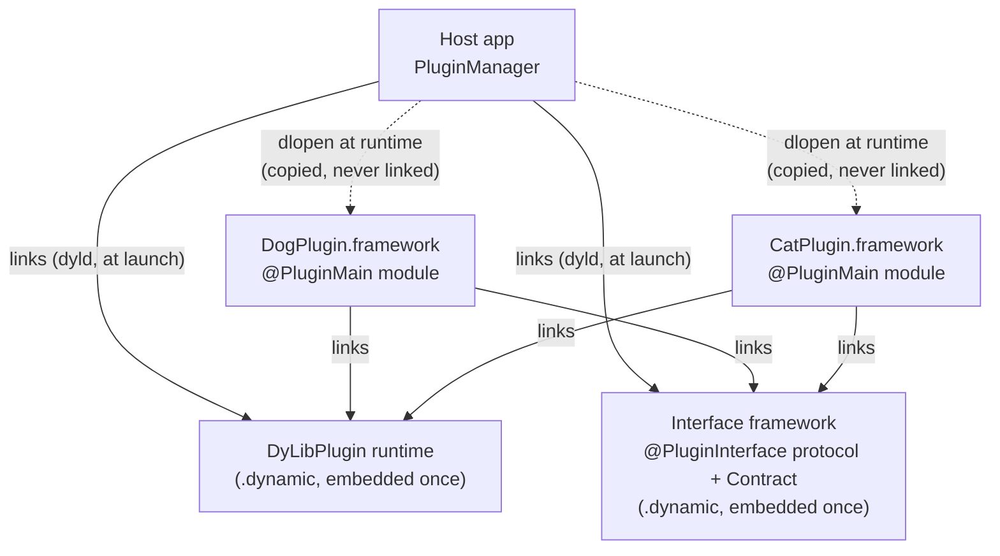
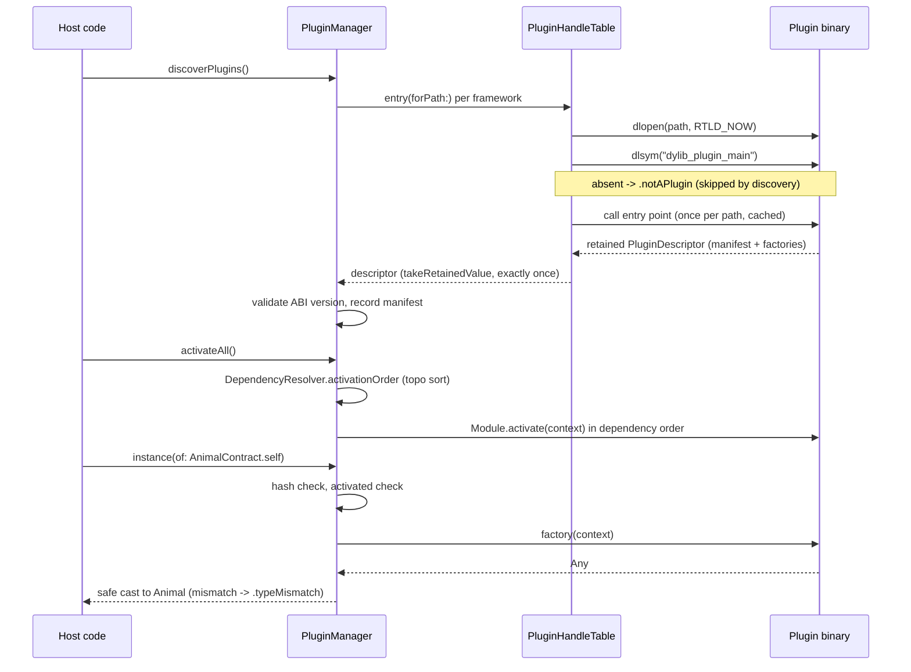

# DyLibRuntimeLoader

A type-safe runtime plugin system for iOS/macOS: plugins are dynamic frameworks loaded with `dlopen`, discovered and activated by a `PluginManager`, with contracts generated by Swift macros so host and plugins never share magic strings. The README covers the developer-facing story; this file covers the internals an editor of this repo must know.

## Module map

| Path | Product | Role |
|---|---|---|
| `Sources/DyLibPlugin/` | `DyLibPlugin` (**.dynamic**) | Runtime: `PluginManager`, `PluginHandleTable` (dlopen), `DependencyResolver`, manifest/contract/error types, `PluginEntryPoint` (called by generated code), and the macro *declarations* (`Macros.swift`) |
| `Sources/DyLibPluginMacros/` | (compiler plugin) | Macro *implementations*: `PluginInterfaceMacro`, `PluginMainMacro`, `RequirementHasher` (FNV-1a) |
| `Sources/dylib-plugin-verify/` | `dylib-plugin-verify` (executable) | Build-time symbol verification via `nm`/`llvm-nm`; no dependencies by design |
| `Plugins/VerifyDyLibPlugin/` | command plugin | `swift package verify-dylib-plugin --product X --expect-id id` |
| `Sources/TestPluginFixtureInterface/`, `Sources/TestPluginFixture/` | both **.dynamic** | Real dlopen fixtures for integration tests — hand-written mirrors of the macro expansions, deliberately macro-free |
| `Tests/DyLibPluginTests/` | | Swift Testing: resolver graphs, semver, manifest coding, descriptor round-trip, dlopen integration |
| `Tests/DyLibPluginMacrosTests/` | | XCTest + `assertMacroExpansion`: expansions and diagnostics |
| `Demo/` | | AnimalInterface/ToolkitInterface (shared), Dog/Cat/AnimalToolkit plugins, `DynamicLoadingDemo` host app |

## Architecture

Three parties. Shared modules are linked and embedded **exactly once**; plugin frameworks are copied into the bundle but never linked.



Load path (`PluginManager` + `PluginHandleTable`):



## The C ABI contract

- Every plugin binary exports `@_cdecl("dylib_plugin_main")` with signature `@convention(c) () -> UnsafeMutableRawPointer`. The pointer is `Unmanaged.passRetained(PluginDescriptor).toOpaque()`; the host balances it with `takeRetainedValue()` **exactly once per path** (`PluginHandleTable` serializes this with a dedicated load lock and caches the entry forever).
- The symbol name is the same for every plugin: `dlsym` is scoped to the dlopen handle, so there is no collision, and discovery is "probe one well-known name". Per-plugin symbol names were rejected — you cannot probe for a name you would have to already know.
- `@PluginMain` additionally emits `dylib_plugin_id_<sanitized>` — dead code whose only purpose is letting `dylib-plugin-verify` match a binary to an expected plugin id via `nm` without executing anything.
- `PluginDescriptor` is deliberately **non-generic**: generics cannot cross a C boundary, and reconstituting a generic box with the wrong parameter (the 1.x design) is undefined behavior. All typing is recovered host-side with checked `as?` casts.
- `DyLibPluginABI.current` (in `Sources/DyLibPlugin/DyLibPluginABI.swift`) must be bumped whenever the entry-symbol signature or `PluginDescriptor`'s shape changes incompatibly; the manager rejects mismatches with `.abiMismatch`.

## Cross-file invariants (read before editing)

1. **Symbol sanitization exists in three places and must stay byte-identical**: `DyLibPluginABI.sanitizedSymbolComponent` (runtime), `PluginMainMacro.sanitizedSymbolComponent` (macro target cannot import the runtime), and `Sanitizer` in `Sources/dylib-plugin-verify/` (tool has no dependencies). The rule: ASCII letters and digits pass through, everything else becomes `_`.
2. **Fixtures mirror macro output by hand.** `Sources/TestPluginFixtureInterface/` and `Sources/TestPluginFixture/` are what `@PluginInterface`/`@PluginMain` would generate, written out so integration tests never depend on the macro targets. If you change a macro's generated shape, update the fixtures AND the expected strings in `Tests/DyLibPluginMacrosTests/`.
3. **`@inlinable` on generated contract members is load-bearing.** Interface modules are shared dynamic libraries; a plain `static var` would resolve to the single runtime copy for host and plugins alike, so compatibility hashes could never differ and drift detection would be dead. `@inlinable` freezes each binary's compile-time literals. Do not "clean it up".
4. **Never call `dlclose`.** Swift images register type metadata and conformances irreversibly; `deactivate` is deregistration only, and `PluginHandleTable` caches handles forever — including for `.notAPlugin` probes.
5. **Never run user code under a lock.** Module hooks (`activate`/`willDeactivate`) and factories are invoked outside `LockedState.withLock`; read state out, run the user code unlocked, write results back. `PluginManager.State` groups `loaded` + `activated` in one lock because they must change atomically.
6. **Everything shared must be `.dynamic`, embedded once.** The `DyLibPlugin` product and every interface module. Static or duplicated copies mean duplicate protocol metadata and failing cross-image casts.
7. **The macro semver parser mirrors `SemanticVersion.init(parsing:)`** (`PluginMainMacro.semanticVersionComponents`). Keep them agreeing, including their laxness (`Int` parsing accepts `"01"`).

## Conventions

- No file header comments. One type per file. Doc comments only for non-obvious constraints.
- All runtime failures are `PluginError` cases with actionable `description`s (it conforms to `LocalizedError` via `errorDescription: String?` — the optional is required by the protocol; 1.x got this wrong).
- Runtime tests use Swift Testing (`import Testing`, `#expect`); macro tests use XCTest + `assertMacroExpansion` (the swift-syntax test-support idiom).
- Symbols and ids: plugin ids are reverse-DNS strings; interface ids default to the bare protocol name (macros cannot see the module name) — global uniqueness is the author's responsibility, overridable with `@PluginInterface(id:)`.

## Build & test

```sh
swift build                                                   # macOS host (or Linux; dlopen paths are portable)
swift test                                                    # unit + macro + dlopen integration suites
swift package verify-dylib-plugin --product TestPluginFixture --expect-id com.fixture.greeter
```

Known caveats:

- **This code has not been compiled yet.** It was authored in an environment without a Swift toolchain. Expect first-build fixes, most likely in `assertMacroExpansion` whitespace expectations and SwiftPM `PackagePlugin` API details (`tool.url`, `builtArtifacts[].url`/`.kind`).
- **SwiftPM same-package duplication**: the test executable and fixture dylib each statically embed the shared targets, so the integration suite's protocol-cast assertions can fail under plain `swift test` even though the mechanism is correct in a real app. Explained at the top of `Tests/DyLibPluginTests/PluginManagerIntegrationTests.swift`.
- The Demo Xcode project needs one-time re-wiring in Xcode (documented in the README's demo walkthrough).
