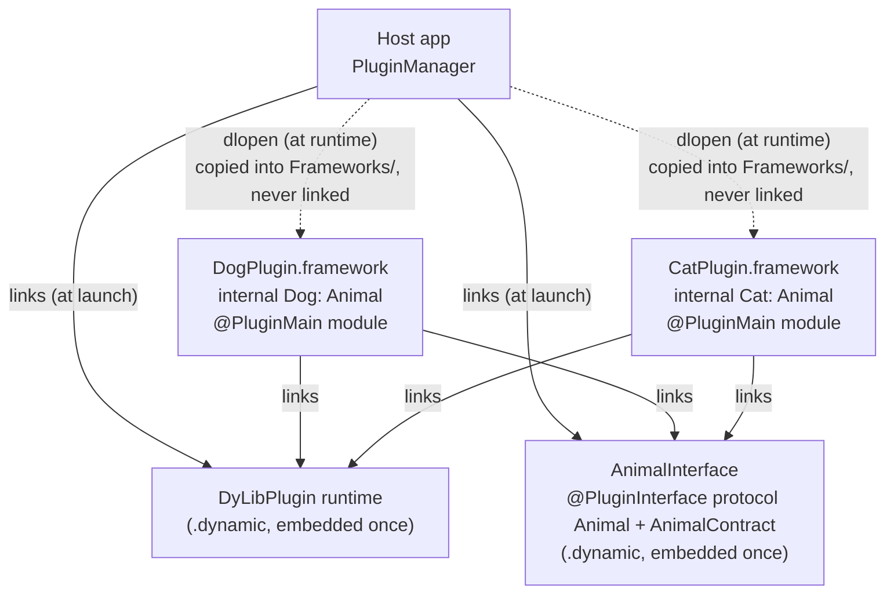
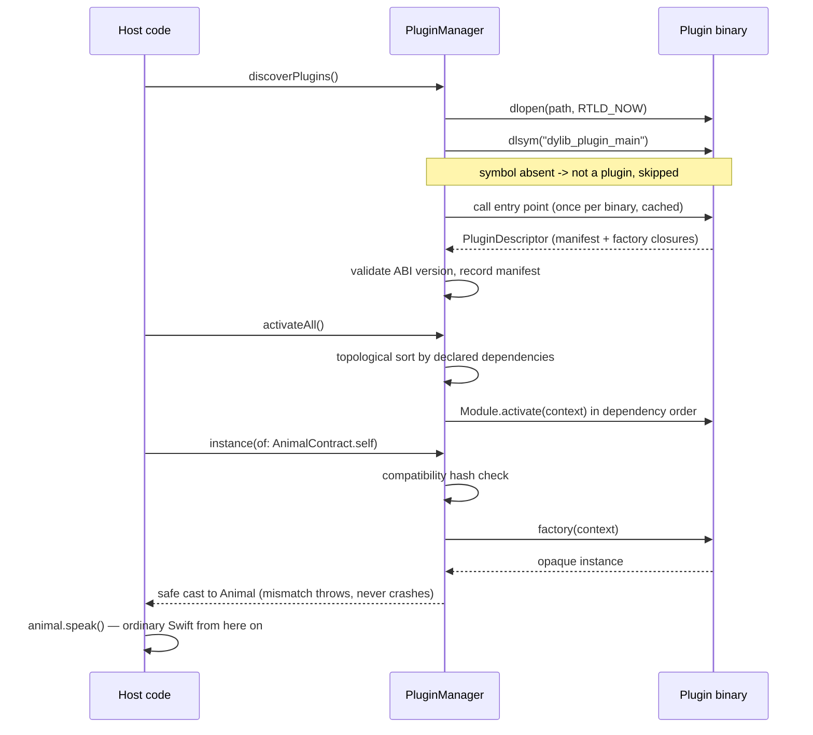
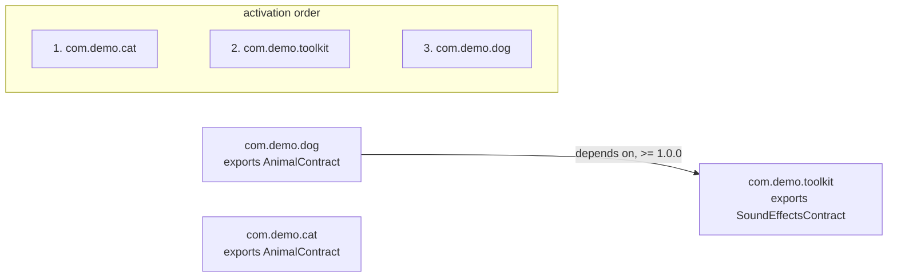

# DyLibRuntimeLoader

A type-safe runtime plugin system for iOS, built on `dlopen` and powered by Swift macros. Annotate a protocol with `@PluginInterface`, annotate a plugin module with `@PluginMain`, and the host loads implementations at runtime through a `PluginManager` — with compile-time-checked contracts, embedded manifests, full inter-plugin dependency resolution, and build-time binary verification. No magic strings, no unsafe casts.


> *Binary is being loaded dynamically from SSD to RAM - Generated by AI*

> **Breaking change**
> Version 2.0 is a clean break from the old string-based API (`dyLibCreator` / `dyLibLoad(withSymbol:fromFramework:forType:)`). The module is now `DyLibPlugin` (the package name stays `DyLibRuntimeLoader`). See [Migration from 1.x](#migration-from-1x).

## Why dynamic loading?

Static and dynamic *linking* are the two options Xcode offers, and both make dyld resolve every framework **before `main()` runs**. Dynamic *loading* is the third mechanism — the one iOS doesn't surface in the UI but fully supports through POSIX `dlopen` — and it changes when and whether code enters your process at all:

- **Launch time.** Every dynamically linked framework is mapped, rebased, and bound during app launch, whether or not this session ever uses it. Loading feature modules on demand moves that cost off the launch path entirely. This is the architecture Meta describes in [The evolution of Facebook's iOS app architecture](https://engineering.fb.com/2023/02/06/ios/facebook-ios-app-architecture/): the app starts with lean interface modules and pulls concrete implementations in at runtime.
- **True implementation hiding.** A plugin ships no importable module. The host compiles against a protocol; the concrete types are `internal` inside a binary Xcode never links. There is no way for host code to grow an accidental dependency on an implementation detail.
- **Behavior is data.** Which implementations exist is decided by which framework binaries are present in the bundle at launch — swap a plugin without recompiling or relinking the app (the [tamper experiment](#the-tamper-experiment) demonstrates this live).
- **Enforced dependency direction.** Interfaces are the only stable, shared surface; implementations depend on them and never on each other's internals. Inter-plugin needs are declared in manifests and resolved by the loader — a dependency graph you can inspect and validate, not an accident of link order.

The tradeoff: `dlopen` gives you raw pointers, magic strings, and undefined behavior when anything disagrees. Closing that gap — with compiler-checked contracts, macros that generate the unsafe machinery, load-time validation, and build-time verification — is the point of this library.

## How it works — from first principles

Everything in this library (macros, manager, manifest) exists to automate and harden one mechanism. Understanding it makes the rest obvious.

### The raw mechanics

1. A **plugin** is just a dynamic framework (a Mach-O binary) sitting in the app bundle's `Frameworks/` directory that the app was **not** linked against — Xcode and dyld know nothing about it at launch.
2. `dlopen(path)` asks dyld to map that binary into the running process. Now its code exists in memory, but you have no way to *name* anything inside it from Swift.
3. `dlsym(handle, "name")` gives you a raw pointer to one **exported symbol** by string name. This is the only door into the plugin — and it only works reliably for **C functions**, because Swift names are mangled and Swift calling conventions are not stable across the boundary.

So the fundamental constraint is: **exactly one thing can safely cross the dlopen boundary — a C function pointer with an agreed-upon signature.** You cannot `dlsym` a Swift protocol, a method, or a generic. Any design must funnel through that needle.

### The trick: cross the boundary once, then use normal Swift

You do *not* look up each plugin function individually. Instead:

- Host and plugin both compile against a **shared interface framework** (embedded once in the app, linked by both) that defines an ordinary Swift protocol:
  ```swift
  public protocol Animal { func speak() -> String }
  ```
- The plugin exports **one** C function whose only job is to hand back a Swift **object**.
- The host calls that one C function via `dlsym`, receives the object, and casts it to the protocol.
- From that moment on, `animal.speak()` is a **perfectly normal Swift protocol call** — dynamic dispatch through the protocol's witness table, which works because both binaries share the *same* protocol definition from the shared interface framework. No `dlsym` per function, no signature re-declaration, no C shims for each method.

The Swift protocol *is* the function-signature contract, type-checked by the compiler on both sides. The plugin can't compile a `speak() -> Int` against it; the host can't call a `bark()` that isn't in it. Adding a function to the contract = adding a requirement to the protocol; both sides get compile errors until they agree.

Solid arrows are ordinary dynamic links that dyld resolves at launch; dotted arrows are the runtime `dlopen` path — the only place this library does anything unusual:



### What happens at runtime, step by step

1. `discoverPlugins()` lists framework binaries in the bundle's `Frameworks/` directory.
2. For each: `dlopen(path, RTLD_NOW)` — dyld maps it and resolves its links (against the already-loaded shared interface and runtime frameworks).
3. `dlsym(handle, "dylib_plugin_main")` — present? It's a plugin (the lookup is scoped to this handle, so every plugin can use the same symbol name). Absent? Not a plugin; skip.
4. The entry point is called through one fixed C signature and returns a retained pointer to a **non-generic** descriptor class carrying the plugin's manifest plus a dictionary of factory closures keyed by interface ID. Nothing is constructed yet — the call only records factories.
5. Validate: runtime ABI version matches, manifest decodes, declared exports are present. Errors here are typed and actionable, not crashes.
6. `activateAll()` topologically sorts all registered manifests by their declared dependencies (with cycle/missing/version errors) and runs each module's `activate(context:)` in order.
7. `instance(of: AnimalContract.self)` finds a plugin exporting `AnimalContract.interfaceID` (hash-checked), invokes its stored factory, and performs a **safe** `as? Animal` cast — a mismatch throws `.typeMismatch` instead of being undefined behavior.
8. Every subsequent `animal.speak()` is plain protocol dispatch. The dlopen boundary was crossed exactly once.



### Why the pieces exist

| Piece | The first-principles problem it solves |
|---|---|
| Shared interface framework | Protocol metadata must exist exactly once in the process, or casts fail |
| `@_cdecl` fixed entry symbol | `dlsym` needs a stable, unmangled C name |
| Non-generic `PluginDescriptor` | Generics can't cross a C boundary; a mismatch in a generic box is undefined behavior |
| Factory closures in a registry | Defer construction; nothing runs until the host asks; multiple interfaces per plugin |
| `@PluginInterface` contract + hash | Host and plugin must agree on the *version* of the protocol, checked at load, not at crash |
| `@PluginMain` macro | Authors should never hand-write the `@_cdecl`/`Unmanaged` machinery |
| Manifest + resolver | Plugins that need other plugins must be activated in the right order |

## Quickstart

Three parties: an interface package (shared vocabulary), a plugin package (hidden implementation), and the host app. All library products involved **must** be `type: .dynamic` — see [Requirements & caveats](#requirements--caveats).

### 1. The interface package

Declare the protocol both sides compile against and annotate it with `@PluginInterface`. The macro generates an `AnimalContract` type — the typed key used instead of magic strings, carrying a stable `compatibilityHash` of the protocol's requirements so interface drift between separately built binaries is caught at load time.

```swift
import DyLibPlugin

@PluginInterface
public protocol Animal {
    func speak() -> String
}
```

```swift
// swift-tools-version: 6.0
import PackageDescription

let package = Package(
    name: "AnimalInterface",
    platforms: [.iOS(.v16), .macOS(.v13)],
    products: [
        .library(name: "AnimalInterface", type: .dynamic, targets: ["AnimalInterface"])
    ],
    dependencies: [
        .package(url: "https://github.com/duyquang91/DyLibRuntimeLoader", from: "2.0.0")
    ],
    targets: [
        .target(
            name: "AnimalInterface",
            dependencies: [.product(name: "DyLibPlugin", package: "DyLibRuntimeLoader")])
    ]
)
```

### 2. The plugin package

The implementation stays `internal` — the host never imports this module. `@PluginMain` generates the exported C entry point and embeds the manifest (id, version, exports, dependencies) into the binary.

```swift
import AnimalInterface
import DyLibPlugin

struct Cat: Animal {
    func speak() -> String {
        "meow"
    }
}

@PluginMain(id: "com.demo.cat", version: "1.0.0")
struct CatPluginModule: PluginModule {
    static func register(in registry: PluginRegistry) {
        registry.export(AnimalContract.self) { _ in Cat() }
    }
}
```

`registry.export` is generic over the contract, so the compiler rejects a factory that doesn't return an `Animal`. One `@PluginMain` per plugin binary; a module may export many interfaces.

```swift
// swift-tools-version: 6.0
import PackageDescription

let package = Package(
    name: "CatPlugin",
    platforms: [.iOS(.v16), .macOS(.v13)],
    products: [
        .library(name: "CatPlugin", type: .dynamic, targets: ["CatPlugin"])
    ],
    dependencies: [
        .package(url: "https://github.com/example/AnimalInterface", from: "1.0.0"),
        .package(url: "https://github.com/duyquang91/DyLibRuntimeLoader", from: "2.0.0"),
    ],
    targets: [
        .target(
            name: "CatPlugin",
            dependencies: [
                "AnimalInterface",
                .product(name: "DyLibPlugin", package: "DyLibRuntimeLoader"),
            ])
    ]
)
```

### 3. The host

The host links `DyLibPlugin` and the interface package normally (Embed & Sign). Plugin frameworks are **not** linked — they are copied into the bundle's `Frameworks/` directory (see [Demo walkthrough](#demo-walkthrough)) and found at runtime:

```swift
import AnimalInterface
import DyLibPlugin

let manager = PluginManager()
try manager.discoverPlugins()                               // scan Frameworks/, probe candidates
try manager.activateAll()                                   // dependency-ordered activation
let animal = try manager.instance(of: AnimalContract.self)  // -> Animal, no strings anywhere
print(animal.speak())                                       // ordinary Swift call from here on
```

To load a specific binary instead of scanning, register a location explicitly:

```swift
try manager.register(.framework(name: "CatPlugin"))         // <bundle>/Frameworks/CatPlugin.framework
try manager.register(.path("/path/to/libCatPlugin.dylib"))  // tests and development
```

When several plugins export the same interface, disambiguate with the source plugin id: `try manager.instance(of: AnimalContract.self, from: "com.demo.cat")`. `manager.registeredManifests` lists everything that was discovered; `deactivate(_:)` runs the module's `willDeactivate` hook and removes its registration. Every failure throws a `PluginError` with a readable description — incompatible interface hashes, missing dependencies, ABI mismatches, factories returning the wrong type, and so on.

## Dependencies between plugins

Plugins can depend on interfaces exported by other plugins. The manager activates the graph in dependency order:



The demo's `DogPlugin` decorates its bark with a sound effect provided by a separate toolkit plugin:

```swift
import AnimalInterface
import DyLibPlugin
import ToolkitInterface

@PluginMain(id: "com.demo.dog", version: "1.0.0")
struct DogPluginModule: PluginModule {
    static let dependencies: [PluginDependency] = [
        .plugin("com.demo.toolkit", .from(SemanticVersion(1, 0, 0)))
    ]

    static func register(in registry: PluginRegistry) {
        registry.export(AnimalContract.self) { context in
            Dog(soundEffects: try? context.instance(of: SoundEffectsContract.self))
        }
    }
}
```

The pieces:

- **Declaration** — `dependencies` lists the plugin ids this module needs, each with a version requirement: `.exact(...)`, `.from(...)` (same major, at least the given version), or `.atLeast(...)`.
- **Ordering** — `activateAll()` topologically sorts all registered manifests, so `com.demo.toolkit` is activated before `com.demo.dog`. A plugin's `activate(context:)` hook and its factories can safely resolve dependency interfaces through the `PluginContext` they receive.
- **Resolution** — `context.instance(of: SoundEffectsContract.self)` resolves the interface exactly like the host-side call, including hash checks and safe casting.
- **Errors** — the resolver reports problems up front, before any activation runs:
  - `.missingDependency(required:requiredBy:)` when a required plugin is not registered (delete the toolkit framework from the demo bundle to see it surfaced in an alert);
  - `.versionUnsatisfied(...)` when a registered dependency's version doesn't satisfy the requirement;
  - `.dependencyCycle(path:)` when plugins require each other, reporting the cycle path.

## Build-time verification

A stale or misnamed binary is the classic dynamic-loading failure mode: everything compiles, then nothing loads. The `dylib-plugin-verify` tool inspects a built binary's exported symbols (no code is executed) and fails loudly when the plugin entry point is missing, exported more than once, or belongs to a different plugin id than expected.

For SwiftPM builds, the command plugin locates the built product for you:

```sh
swift package verify-dylib-plugin --product DogPlugin --expect-id com.demo.dog
```

For Xcode builds, add a Run Script phase after the copy step that produces the plugin framework:

```sh
dylib-plugin-verify --expect-id com.demo.dog \
    "$BUILT_PRODUCTS_DIR/DogPlugin.framework/DogPlugin"
```

`--expect-id` matches the per-plugin marker symbol that `@PluginMain` emits alongside the entry point, catching "right framework name, wrong (or stale) binary inside" mistakes at build time instead of at runtime.

## Demo walkthrough

Everything lives under [Demo/](./Demo/):

```text
Demo/Animals/AnimalInterface    @PluginInterface protocol Animal          (shared, linked by host + plugins)
Demo/Animals/ToolkitInterface   @PluginInterface protocol SoundEffects    (shared, linked by host + plugins)
Demo/Animals/AnimalToolkit      plugin com.demo.toolkit — exports SoundEffectsContract
Demo/Animals/Dog                plugin com.demo.dog — exports AnimalContract, depends on com.demo.toolkit
Demo/Animals/Cat                plugin com.demo.cat — exports AnimalContract, no dependencies
Demo/DynamicLoadingDemo         host app: PluginManager -> discoverPlugins -> activateAll -> instance(of:)
```

### Building the plugin frameworks

Prebuilt binaries are no longer checked into the repo — build them from source. Each plugin package is an ordinary SwiftPM package with a dynamic library product, so Xcode's package support can produce a framework directly:

```sh
cd Demo/Animals/Dog
xcodebuild -scheme DogPlugin -configuration Release \
    -destination "generic/platform=iOS Simulator" \
    -derivedDataPath .build/xcode
# -> .build/xcode/Build/Products/Release-iphonesimulator/PackageFrameworks/DogPlugin.framework
```

Repeat for `CatPlugin` and `AnimalToolkit`. To produce a distributable multi-platform artifact instead, wrap the slices with `xcodebuild -create-xcframework`, or use [swift-create-xcframework](https://github.com/unsignedapps/swift-create-xcframework).

### Wiring the host app

The embedding rule is the heart of the demo:

- **Link + embed normally (Embed & Sign)**: `DyLibPlugin`, `AnimalInterface`, and `ToolkitInterface`. These are the shared dynamic modules — each must be in the app exactly once, and dyld must load them at launch so plugin links resolve against them.
- **Copy, do not link**: `DogPlugin.framework`, `CatPlugin.framework`, `AnimalToolkit.framework`. Add them to a Copy Files build phase with destination "Frameworks" — and do *not* add them to "Link Binary With Libraries". Xcode and dyld stay unaware of them; only `PluginManager` ever touches them.

> **Note: the demo project needs one-time re-wiring in Xcode**
> This repo was restructured without Xcode available, so the app project ships with only `AnimalInterface` and `DyLibPlugin` wired up. After opening `Demo/DynamicLoadingDemo/DynamicLoadingDemo.xcodeproj`:
> 1. Add the local package `Demo/Animals/ToolkitInterface` and link + embed its `ToolkitInterface` product (Embed & Sign), alongside the existing `AnimalInterface` and `DyLibPlugin` products.
> 2. Build `DogPlugin`, `CatPlugin`, and `AnimalToolkit` frameworks as shown above, then add the built `.framework` bundles to the existing Copy Files phase (destination "Frameworks"). Do not link them.
> 3. Copy only the plugin frameworks themselves — not the `AnimalInterface`/`ToolkitInterface`/`DyLibPlugin` frameworks from the plugin build products, which would duplicate modules the app already embeds.

Run the app: **Load** discovers and activates every plugin in `Frameworks/` and lists their manifests (`com.demo.toolkit 1.0.0`, `com.demo.dog 1.0.0`, ...); **Speak** calls `animal.speak()` through the shared protocol.

### The tamper experiment

The old demo's best trick still works, and now it also demonstrates dependency resolution. Close Xcode and find the booted simulator's app bundle:

```sh
xcrun simctl list | egrep '(Booted)'
```

```text
~/Library/Developer/CoreSimulator/Devices/{sim_uuid}/Data/Containers/Bundle/Application/{app_uuid}/DynamicLoadingDemo.app/Frameworks
```

Try these and relaunch the app after each:

| Action | Result |
|---|---|
| Delete `DyLibPlugin`, `AnimalInterface`, or `ToolkitInterface` framework | Immediate crash at launch. These are dynamically *linked*: dyld loads them before `main` runs and aborts when one is missing. |
| Delete `DogPlugin.framework` (keep `CatPlugin.framework`) | App launches normally — nothing links against plugins. `discoverPlugins()` simply finds fewer candidates, and `speak()` now says "meow": the Cat plugin serves `AnimalContract` instead. |
| Delete `AnimalToolkit.framework` (keep `DogPlugin.framework`) | App launches, but **Load** shows the resolver error: `Plugin "com.demo.dog" depends on "com.demo.toolkit", which is not registered.` Dependency problems are reported as data, not crashes. |
| Drop in a plugin framework built against an older `Animal` protocol | **Load** reports `.interfaceIncompatible` with both requirement hashes — the drift detector catching a stale binary. |

This bypasses no code signing on a real device — it works in the simulator because bundles there are plain directories. It demonstrates the mechanism: the app's behavior is determined by whichever plugin binaries are present at launch, with the loader validating everything it finds.

## Requirements & caveats

- **Platforms & toolchain**: iOS 16+ / macOS 13+, Swift 6.0 tools. The macros pull in [swift-syntax](https://github.com/swiftlang/swift-syntax), so the first build of a plugin or interface package compiles swift-syntax — expect a one-time multi-minute hit.
- **Everything shared must be dynamic, exactly once.** `DyLibPlugin`, every interface module, and every plugin binary must be `.dynamic` library products, and the shared modules must be embedded in the app exactly once. A statically linked (or duplicated) interface module means two copies of the protocol metadata in the process, and cross-boundary casts will fail.
- **No true unload.** `dlclose` is unsafe for Swift dylibs: type metadata, protocol conformances, and ObjC classes are registered with the runtime irreversibly. `deactivate(_:)` runs the module's `willDeactivate` hook and removes its registration; the image stays mapped for the life of the process. This is deliberate.
- **App Store**: only code-signed frameworks shipped inside the app bundle may be loaded. Downloading executable code violates App Review Guideline 2.5.2. `PluginLocation.path(_:)` exists for tests and development, not for sideloading.
- **`@_cdecl` is an underscored attribute.** It is ubiquitous and has been stable for years (the macro generates it so you never write it), but it is not formally covered by Swift source stability.
- **The compatibility hash is a best-effort drift detector, not an ABI proof.** It is computed from the protocol's requirement signatures at macro-expansion time and baked into each binary via `@inlinable`. In unoptimized builds inlining is not guaranteed, and the hash cannot capture semantic changes that leave signatures intact. Treat a hash mismatch as a definite error; treat a hash match as a strong hint, not a guarantee.
- **A foreign dylib exporting `dylib_plugin_main` with the wrong shape can still crash at probe.** The convention, the ABI version field, and the build-time verifier make this unlikely, but the C boundary is ultimately trust-based.

## Migration from 1.x

The 1.x API was string-based and type-unsafe at the boundary; 2.0 removes it entirely. Module name changes from `DyLibRuntimeLoader` to `DyLibPlugin`.

| 1.x | 2.0 |
|---|---|
| Hand-written `@_cdecl("load_animal") func load() -> UnsafeMutableRawPointer { dyLibCreator(factory: Dog(), forType: Animal.self) }` | `@PluginMain(id: "com.demo.dog", version: "1.0.0") struct DogPluginModule: PluginModule` with `registry.export(AnimalContract.self) { _ in Dog() }` |
| Plain `public protocol Animal` | `@PluginInterface public protocol Animal` (generates `AnimalContract`) |
| `try dyLibLoad(withSymbol: "load_animal", fromFramework: .framework(name: "AnimalImplementation"), forType: Animal.self)` | `try manager.instance(of: AnimalContract.self)` after `discoverPlugins()` + `activateAll()` |
| `FrameworkName.framework(name:)` / `.path(...)` | `PluginLocation.framework(name:in:)` / `.path(...)` — or skip it entirely with `discoverPlugins()` |
| `DynamicFrameworkLoaderError` | `PluginError` (typed cases with readable descriptions) |
| Symbol/type mismatch = undefined behavior | Typed errors: `.notAPlugin`, `.interfaceIncompatible`, `.typeMismatch`, ... |
| No lifecycle, no dependencies | `activate`/`willDeactivate` hooks, `dependencies` with version requirements, topological activation |
